# Project Overview

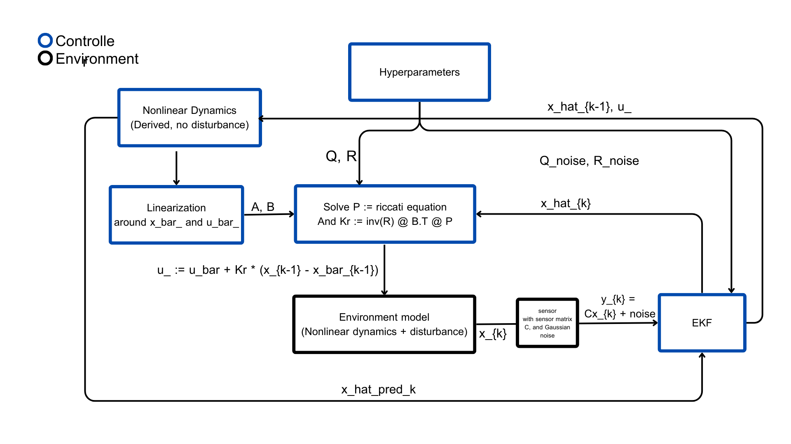
*Figure 1: High-level control/estimation loop. The nonlinear planar quadrotor + suspended payload model is simulated (environment). The model is linearized about an equilibrium (x̄, ū) to compute continuous-time LQR gains (A,B → solve ARE → K). The controller applies u = ū + K (x̂ − x̄). An EKF fuses noisy measurements (x, z, θ_d) with the nonlinear model to estimate the full state x̂_k, which is fed back to the controller. Disturbances and sensor noise are injected at the environment (w, v)*
        

This project investigates the dynamics and control of a planar quadrotor with a suspended payload, operating under nonlinear dynamics and limited sensing constraints. The system is modeled using first-principles dynamics and linearized around a hover equilibrium to facilitate the design of a Linear Quadratic Regulator (LQR) for trajectory tracking. An Extended Kalman Filter (EKF) is implemented to estimate the full system state from a minimal set of realistic measurements. To evaluate stability, robustness, and controller performance under non-ideal conditions, disturbances and sensor noise are injected directly into the nonlinear plant simulation.


# System modelling
## Coordinates and assumptions
* Diagram 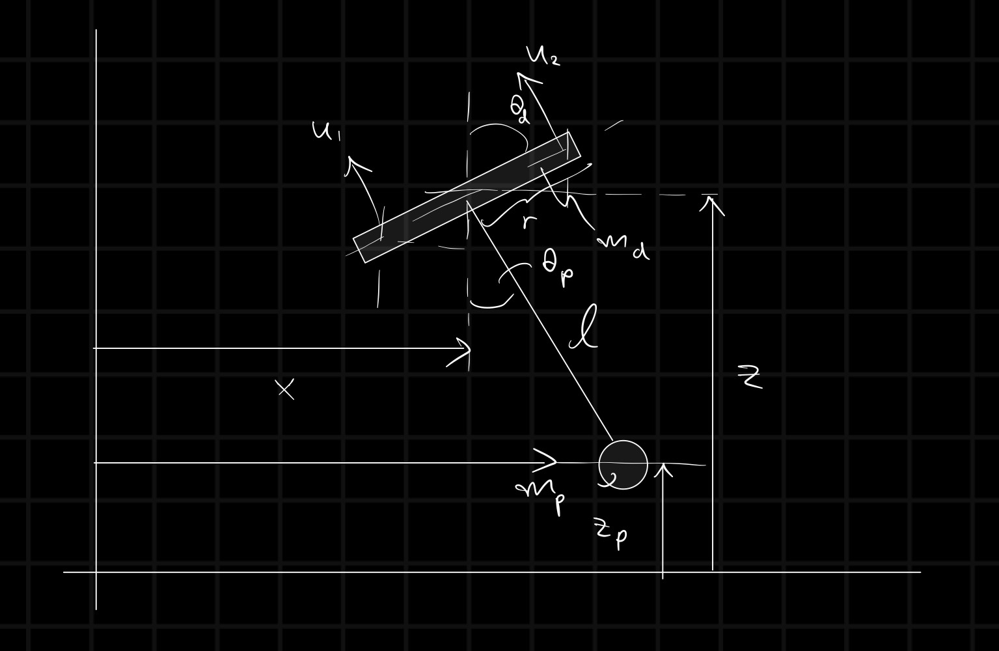
* State: We define the configuration vector q and the full state vector $\underline x$ as:

$$q = [x, z, \theta_d, \theta_p] \\ \underline{x} = [q, \dot{q}] = [x, \dot{x}, z, \dot{z}, \theta_d, \dot{\theta_d}, \theta_p, \dot{\theta_p}]$$

*where \theta_d is the drone's attitude and \theta_p is the package swing angle.* 

* Angle convention
	* $\theta_d$ is measured clockwise (drone tilt)
	* $\theta_p$ is measured counter-clockwise (payload swing)
* The package is modeled as a point mass connected by a massless, rigid string.
* The drone is modeled as a 2D rigid rod.
* Noise: All environmental disturbances and sensor noises are assumed to be Gaussian.

## System dynamics
* $m_d, m_p$ are masses of the drone and the package, respectively. $l$ is a length of the rigid string from the drone to the package. $I_{cm}$ is the moment of inertia of the drone at the center of mass. $r$ is the length from CM of the drone to each propeller
* $[x, z]$ are vectors from origin to $CM in the $x-z$ coordinate
* Energy & Lagrangian: We derive the equations of motion using the Lagrangian method. First, we define the Kinetic Energy (T) and Potential Energy (U):ss

$$T = \frac 1 2 (m_d + m_p) (\dot{x}^2+\dot{z}^2) + m_pl\dot{\theta_p} (\dot{x}\cos{\theta_p} + \dot{z}\sin{\theta_p}) + \frac 1 2 m_p l ^2 \dot{\theta_p}^2 + \frac 1 2 I_{cm} \dot{\theta_d}^2$$
$$U = (m_p + m_d)gz - m_pgl\cos{\theta_p}$$
* Now, we use Euler–Lagrange equation

$$\frac d {dt} \frac {\partial} {\partial{\underline {\dot{q}}}} L - \frac {\partial} {\partial \underline {q}} L = Q$$

* This yields the standard manipulator equation in q-space, $M(q)\ddot{q} + C(q,\dot{q})\dot{q} = \tau(q) + Bu$, we get

$$M = \begin{bmatrix}  
m_d+m_p & 0 & 0 & m_pl\cos \theta_p \\  
0 & m_d+m_p & 0  & m_pl\sin \theta_p \\
0 & 0 & I_{cm} & 0 \\
m_pl\cos \theta_p & m_pl\sin \theta_p & 0 & m_pl^2 \\
\end{bmatrix}, 
C(q, \dot{q}) = \begin{bmatrix}  
0 & 0 & 0 & -l\dot \theta_p\sin \theta_p \\  
0 & 0 & 0  & l\dot \theta_p\cos \theta_p \\
0 & 0 & 0 & 0 \\
0 & 0 & 0 & 0 \\
\end{bmatrix}$$

$$
\tau(q) = \begin{bmatrix}  
0 \\  
-(m_p+m_d)g \\
0 \\
-m_pgl\sin \theta_p
\end{bmatrix},
B = \begin{bmatrix}  
\cos \theta_d & \cos \theta_d\\  
\sin \theta_d & \sin \theta_d\\
r & -r \\
0 & 0
\end{bmatrix},
$$

* Thus, we can compute $\underline {\ddot q}$ with $\underline {\ddot q} = M^{-1}(\tau + Bu - C \underline {\dot q})$
* u is the input, in this case, thrusts created by each of the propellers


# Linearization
To control the drone using LQR, we first need a linear representation of our system in the standard state-space form: $\dot {\underline x} = A {\underline x} + B {\underline u}$. Since our actual dynamics are nonlinear, we linearize the model around a stable equilibrium point.

Equilibrium State We choose the "hover" configuration as our equilibrium. In this state, the drone is horizontal, the payload hangs directly downward, and the total thrust equals the total weight of the system (Mg).

$$\underline {\bar{x}} = [x_{ref}, 0, z_{ref}, 0, \frac \pi 2, 0, 0, 0]$$

$$\underline {\bar u} = [\frac 1 2 (m_d + m_p)g, \frac 1 2 (m_d + m_p)g]$$

*where $x_{ref}$ and $z_{ref}$ are final coordinates we want our drone to be*

Given $\underline{\dot x} = \underline{f}(\underline x, \underline u)$ where $\underline{f}(\underline x, \underline u)$ is a non-linear dynamics, we can approximate around an equilibrium point using Taylor's series

* $\Delta{\underline{x}}$ is a vector from an equilibrium point to a nearby point, as it is the nearby point, $\Delta{\underline{x}}$ is small, thus, $\Delta{\underline{x}}^2, \Delta{\underline{x}}^3, ...$ are incredibly small, so we can neglect them! Thus
$$\Delta\underline{\dot{x}} = \frac D {D\underline{x}} f(\bar{\underline{x}}, \bar{u}) \Delta{x}+ \frac D {Du} f(\bar{\underline{x}}, \bar{u}) \Delta{u}$$

* Note: $\frac D {D \underline{x}} f$ is a Jacobian matrix. 
* Thus $A = \frac D {D\underline{x}} f(\bar{\underline{x}}, \bar{u}), B = \frac D {Du} f(\bar{\underline{x}}, \bar{u})$, I can, now, use LQR, determine observability and controllability of the system!

# Controller
## Overview of the control, in full state feedback case.
*the image is from https://www.mathworks.com/discovery/optimal-control.html*

We employ a Linear Quadratic Regulator (LQR) for optimal control. Unlike pole placement, where stability is achieved by manually selecting eigenvalues, LQR finds the optimal gain matrix K by minimizing a specific cost function. This approach allows us to balance the trade-off between trajectory tracking performance and energy consumption. The cost function is

$$J = \int_{0}^{\infty} (\underline{x}^{T}Q\underline{x} + u^{T}Ru) dt$$

- Q (State Penalty): Penalizes the error between the current state and the desired state (tracking accuracy).
- R (Control Penalty): Penalizes the magnitude of the control input (actuator effort).

Solving the Algebraic Riccati Equation yields the optimal gain matrix $K_r$, which is used in the control law $u = -K_rx$.

*there is more mathematical detail on how to compute K, but I am not gonna write it out here as it so long, but I encourage you to look up the calculation detail from this MIT's Underactuated Robotics book [https://underactuated.mit.edu/lqr.html]*

* The state weighting matrix Q is diagonal, allowing us to tune the importance of each state individually:

 $$Q = \begin{bmatrix}  
Qx &  & &  &  &  &  & \\  
 & Q_{\dot{x}}  & &  & & & &\\
 &  & Q_z &  &  &  &  & \\
 &  &  & Q_{\dot{z}} &  &  &  &  \\
 &  &  &  & Q_{\theta_d} &  &  &  \\
 &  &  &  &  & Q_{\dot {\theta_d}} &  &  \\
 &  &  &  &  &  & Q_{\theta_p} &  \\
 &  &  &  &  &  &  & Q_{\dot {\theta_p}} \\
\end{bmatrix}$$

* The control weighting matrix R is also diagonal, penalizing the thrust of the two propellers:

$$R = \begin{bmatrix}R_{u_1} &  \\  
 & R_{u_2}
 \end{bmatrix}$$

* $K_r$ is the optimal gain 1x8 matrix, 

$$K_r = \begin{bmatrix}  k_1 & ... & k_8 \end{bmatrix}$$ 

Unlike an inverted pendulum system where the equilibrium control input is often zero, a multirotor UAV requires a constant non-zero thrust to counteract gravity, even at a stable hover. Relying solely on the proportional feedback combined with the feed-forward equilibrium thrust can result in steady-state errors (oscillating) due to model uncertainties or unmodeled disturbances. To eliminate this offset, we introduce an integral action similar to that used in PID control.

$$K_i = \begin{bmatrix}  
k_x & k_{\dot{x}} & k_z & k_{\dot{z}} & k_{\theta_d} & k_{\dot{\theta_d}} & k_{\theta_p} & k_{\dot{\theta_p}} \\
k_x & k_{\dot{x}} & k_z & k_{\dot{z}} & k_{\theta_d} & k_{\dot{\theta_d}} & k_{\theta_p} & k_{\dot{\theta_p}} \end{bmatrix} $$

*Each row corresponding for each propeller*

It is important to note that only the gains corresponding to altitude (kz​) are non-zero; all other elements are set to zero. This design targets the specific physics of the system: since gravity acts as a constant external bias solely in the vertical axis (z), the integrator is required only to accumulate the altitude error to maintain a precise hover.

However, in this project, $\underline{y} \ne \underline x$ but instead $\underline y = C\underline x$. So instead of straight up passing $\underline y$ into our controller like in the diagram, we must pass $\underline y$ into our observer first.

# Observer
## Overview of the observer
In this project, we assume the system does not have access to the full state vector. Instead, we rely on a realistic set of sensors that provide 3 specific measurements out of the 8 total states:
1. Horizontal coordinate, $x$, via a GPS
2. Vertical coordinate, $z$, via an altimeter 
3. Drone tilt, $\theta_d$, via an IMU

*These  are minimum sensors on a real drone.*

This sensor configuration is defined by the observation matrix

$$C = \begin{bmatrix}  
1 & 0 & 0 & 0 & 0 & 0 & 0  & 0 \\
0 & 0 & 1 & 0 & 0 & 0 & 0 & 0 \\
0 & 0 & 0 & 0 & 1 & 0 & 0 & 0\end{bmatrix} $$

Notice that each row corresponds to a single sensor, mapping the full state vector $\underline x$ to the measurement vector $\underline y$ such that $\underline y=C \underline x$.

### Observability 
Before designing the estimator, we must verify if the available sensors are sufficient to reconstruct the full internal state of the system (e.g., can we infer the payload swing velocity just by knowing the drone's position?). We check this by computing the rank of the observability matrix $\mathcal{O}$

$$\mathcal{O} = [C, CA, CA^2, ..., CA^{n-1}]^T$$

n is number of states in x, and, in this case, n = 8

* If rank($\mathcal{O}$) = n, the system is observable, which means we can estimate full state $\underline{x}$ from $\underline{y}$

In our case, around equilibrium point, $\underline {\bar x}$, the system is observable with matrix $C$.

## Extended Kalman Filter (EKF)
Since our system dynamics are highly nonlinear (especially the payload swing), a standard linear Kalman Filter would likely diverge. Instead, we implement an Extended Kalman Filter (EKF), which linearizes the system dynamically at each time step.

The EKF operates in two repeating phases:

**Prediction**: predict the next state $\hat{\underline x}^-$ using **non-linear** physics model. 

$$\hat{\dot {\underline x}}_{k} = \underline{f} (\underline {\hat x}_{k-1}, \underline u)$$

$$\hat{\underline x}^{-}_{k} = \hat {\underline{x}}_{k-1} +\hat{\dot {\underline x}}_{k} \cdot dt$$

Because we did not measure yet, uncertainty, $P_k^-$, increases.

$$P_{k}^- = FP_{k-1}F^T + Q_{noise}$$

* $Q_{noise}$ is the Process Noise Covariance, it is a hyperparameter we have to tune. It is to capture how inaccurate our model is. It is high if we think the environmental disturbance (e.g. gust) is high

* $F$ is a Jacobian matrix at current state $\underline {\hat x}$, i.e., $\frac D {D \underline x}f(\underline x, \underline u)|_{x =\underline {\hat x}_{k-1}}$

**Update**: Measure $\underline y$ and correct the prediction
We get $\underline y$ from the sensors (This is happening in the sensors, not what we can control)

$$\underline y = C \underline{x} + noise$$

Thus, our prediction error is 

$$\Delta \underline y = \underline y - C\hat{\underline x}^{-}_{k} $$

And uncertainty of measurement from the sensors can compute with

$$S =CP_{k+1}^- C^T + R_{noise}$$
* $R_{noise}$ is the sensors noise matrix, it often can be found in sensor sheet

Now, we can compute $K_f$ or Kalman gain which tells us how much we should trust the sensors

$$K_f = P_{k+1}^-C^TS^{-1}$$

Finally, it is time to get $\hat {\underline x}_k$

$$\hat {\underline x}_k = \hat{\underline x}^{-}_{k} + K_f(\Delta {\underline y})$$


$\hat {\underline x}_k$ is what we will send to the controller!

# Results

## Overview & Experimental Setup
The primary control objective is to reach the target coordinates while minimizing the payload swing ($\theta_p$). We define "settling" as the system maintaining the following state bounds for at least 20 seconds:

$$|x - x_{ref}| < 0.05 \wedge |z - z_{ref}| < 0.05 \wedge |\dot x| < 0.05 \wedge |\dot z| < 0.05 \wedge |\theta_p| < 10 \degree$$


Q, R intuition

- $Q_x, Q_z$: penalize position error; higher → faster convergence, but too high → aggressive maneuvers and larger payload swing.
- $Q_{\dot x}, Q_{\dot z}$: penalize speed; higher → safer for payload (limits induced swing) and reduces overshoot.
- $Q_{θ_d}, Q_{\dot θ_d}$: keep drone attitude near horizontal; penalize large tilt and fast attitude changes to avoid motor saturation and structural stress.
- $Q_{θ_p}, Q_{\dot θ_p}$: highest priority if you want to protect the package. Penalize payload angle strongly (θ_p) and its rate to prevent oscillation.
- R (u₁,u₂): penalize actuator effort. Larger R → smoother, safer thrusts; smaller R → more aggressive control. Keep R so commanded thrusts remain within physical bounds (no motor saturation).

System constants
- $m_d$ = 5 kg, $m_p$ = 2 kg, $M = m_d + m_p$
- $r_d$ = 0.5 m, $l$ = 0.5 m
- $\underline x_{ref} = [5 , 0, 5 , 0, \frac \pi 2, 0, 0, 0]$
- $\underline u_{ref} = [\frac {Mg} 2, \frac {Mg} 2]$

$$K_i = \begin{bmatrix}  
0 & 0 & 5 & 0 & 0 & 0 & 0  & 0 \\
0 & 0 & 5 & 0 & 0 & 0 & 0 & 0 \end{bmatrix}$$

- GPS(x): $\sigma$ = 0.8 m (ref: u-blox NEO-M8N)

- Altimeter(z): $\sigma$ = 0.1 m (ref: Bosch BMP388 / BMP390)

- IMU ($\theta_d$): $\sigma$ = 0.02 rad (ref: Bosch BMI088)

$$R_{noise} =
\begin{bmatrix} 0.8^2 &  &\\  
 & 0.1^2 &\\
 & & 0.02^2
 \end{bmatrix}$$
 
*for u clipping*
- $u_{min} = [0.0, 0.0]$
- $u_{max} = [\frac {3M} 2, \frac {3M} 2]$

## Baseline

Using our tuned "Baseline" Q and R matrices, the system performs robustly.

$$
Q_{baseline} = diag([25, 20, 25, 20, 15, 10, 30, 10]) \\
R_{baseline} = diag([0.5, 0.5])
$$


*graphs comparing true values and estimation values of each variable*

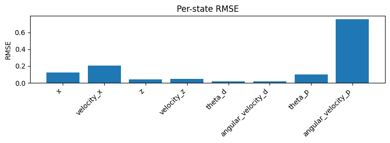
*graph shows rmse of each variable*

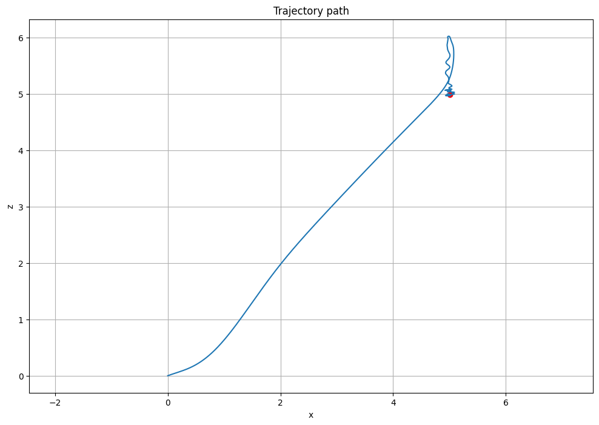
*graph shows trajectory of the drone*

```
Max package swing (degree):  39.81150426563668 
Control Effort Motor 1: [4.37928378] 
Control Effort Motor 2: [4.43946955] 
Settling after: 5.258 seconds
```

## Failure case

To test the limits of LQR, we aggressively penalized payload swing (Q_{{\theta}_p} = 80, up from 30).

- Observation: The controller commanded violent inputs to zero out the swing angle instantly.
- Analysis: This confirms that over-penalizing specific states can push the system outside the linear validity region of the LQR model. The aggressive commands excited nonlinear dynamics that the linearized controller could not predict or counteract.

$$
Q_{fail} = diag([1, 0.5, 5, 1, 8, 1, 80, 10]) \\
R_{fail} = diag([0.5, 0.5])
$$

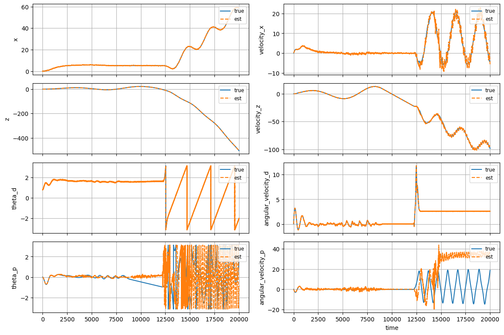
*graphs comparing true values and estimation values of each variable*

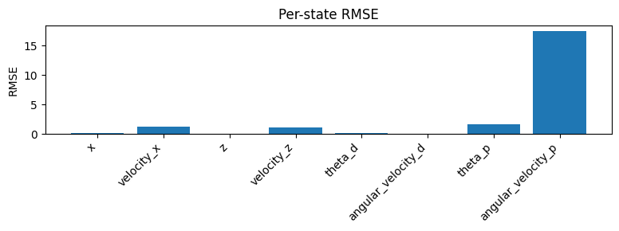
*graph shows rmse of each variable*

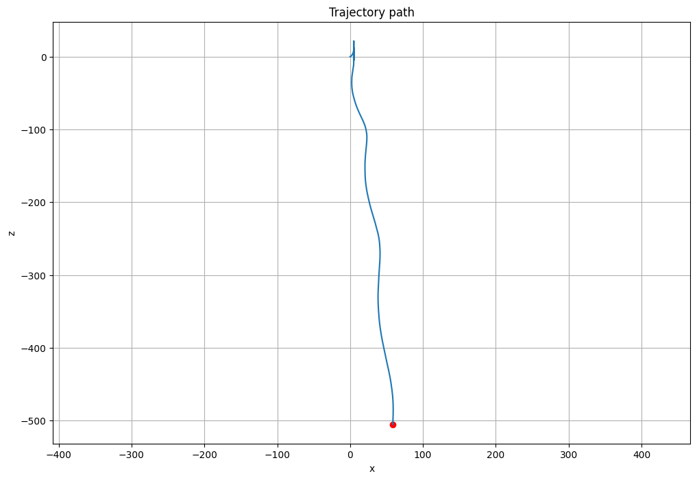
*graph shows trajectory of the drone*

```
Max package swing (degree):  179.99730329689325
Control Effort Motor 1: [39.21058755]
Control Effort Motor 2: [39.47316862]
The drone never settle
```

## Robustness test
We subjected the baseline controller to adverse environmental conditions.
### Sinusoidal gust
Disturbance: 

$$F(t) = 0.1Mg \sin (2 \pi \cdot 1.5t)$$

Result: The system settled in 11.43 seconds. Despite the constant external forcing, the integral term and LQR feedback successfully maintained stability, albeit with increased payload swing (~65°).


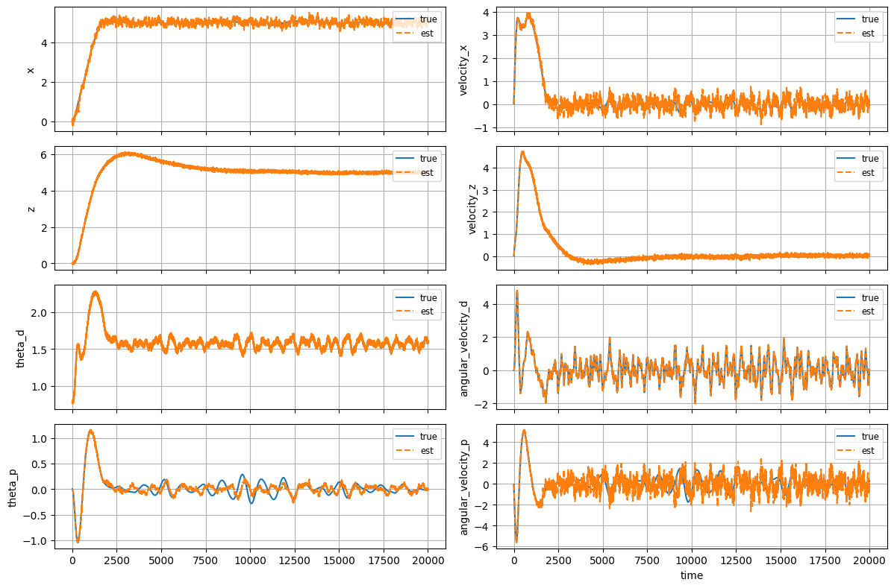
*graphs comparing true values and estimation values of each variable*


*graph shows rmse of each variable*


*graph shows trajectory of the drone*

```
Max package swing (degree):  64.91850800077341
Control Effort Motor 1: [7.45489251]
Control Effort Motor 2: [7.46984197]
Settling after: 11.431000000000001 seconds
```

### Sensor noise increases
We scaled the standard deviation of all sensor noise by a factor n.

#### n = 2
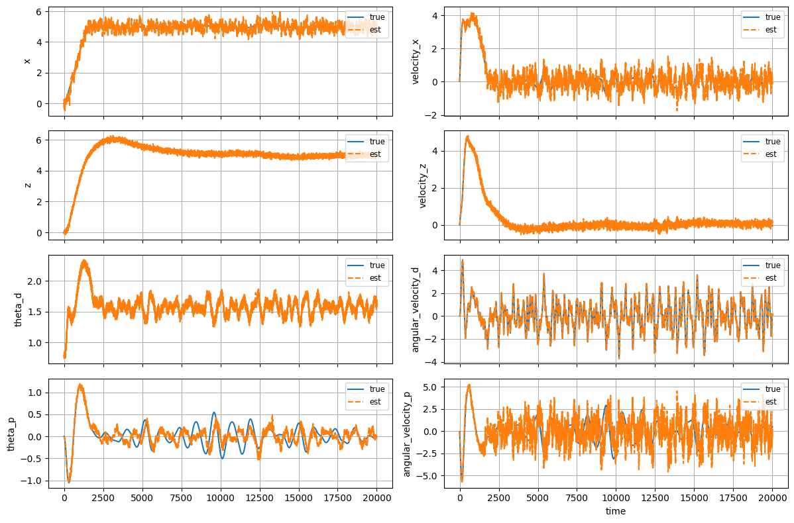
*graphs comparing true values and estimation values of each variable*


*graph shows rmse of each variable*

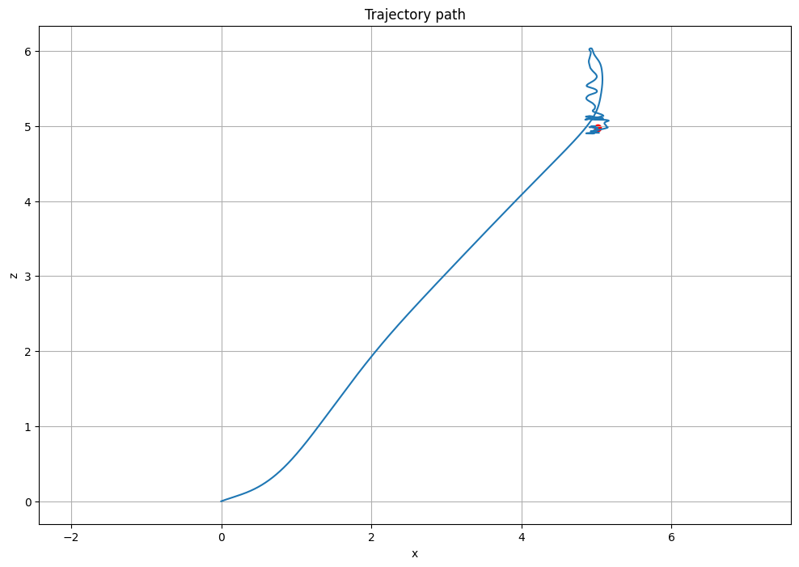
*graph shows trajectory of the drone*

```
Max package swing (degree):  65.77895210530531
Control Effort Motor 1: [13.21638327]
Control Effort Motor 2: [13.2817721]
Settling after: 16.281 seconds
```

#### n = 3
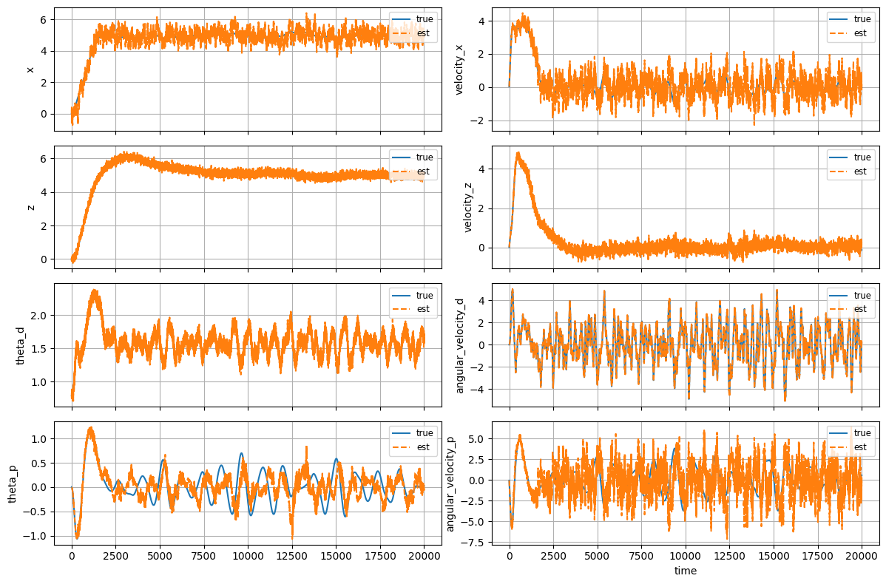
*graphs comparing true values and estimation values of each variable*

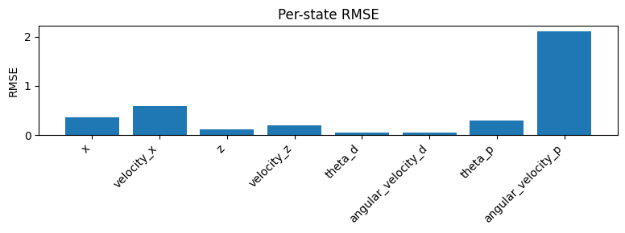
*graph shows rmse of each variable*

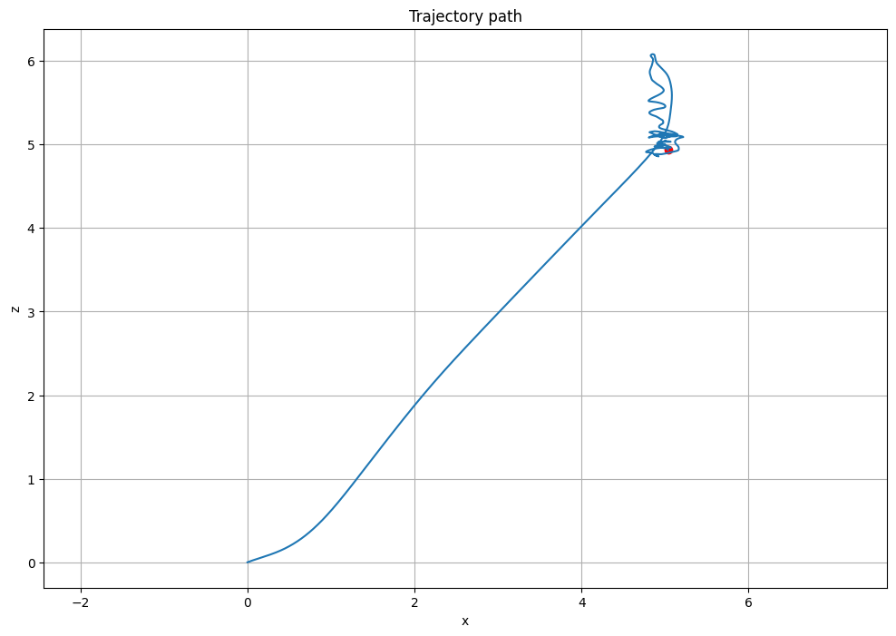
*graph shows trajectory of the drone*

```
Max package swing (degree):  66.97846057547555
Control Effort Motor 1: [18.20949201]
Control Effort Motor 2: [18.44967125]
Settling after: 16.342 seconds
```

#### n = 4
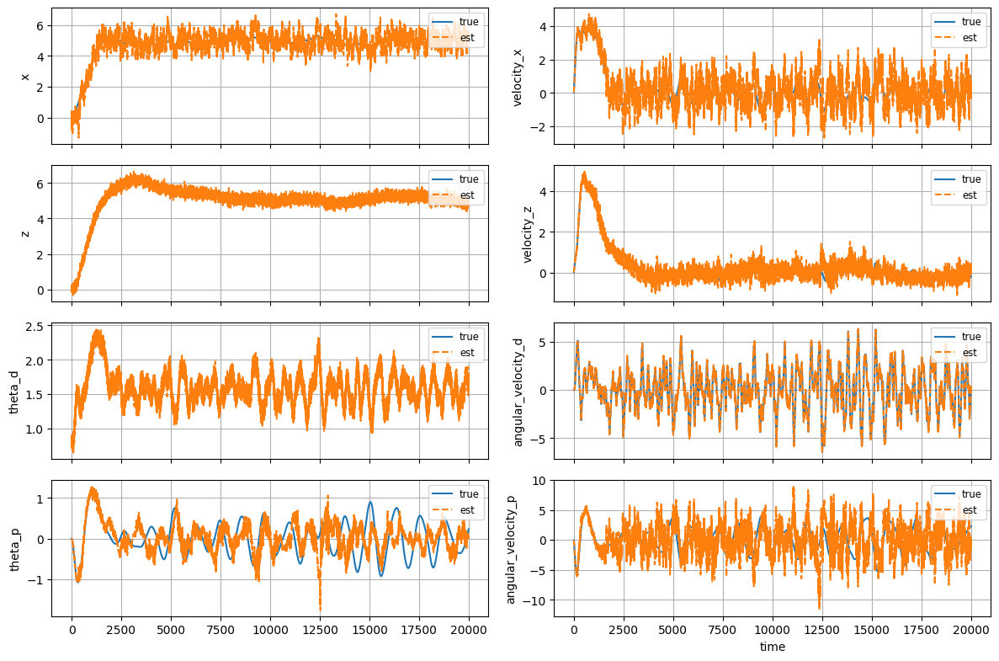
*graphs comparing true values and estimation values of each variable*


*graph shows rmse of each variable*

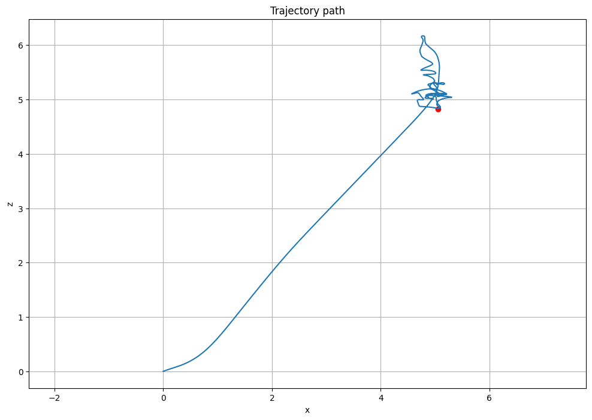
*graph shows trajectory of the drone*

#### Conclusion
The system is robust to noise levels up to 3x the specification of standard commercial sensors.

```
Max package swing (degree):  68.37264148916749
Control Effort Motor 1: [22.44804497]
Control Effort Motor 2: [22.81308394]
The drone never settle
```

## Sensitivity study
We conducted a grid search on payload angle penalty $Q_{\theta_p}$ and control penalty $R$ over a 3×3 to optimize performance. A composite score was calculated as: $2{\theta_p}_{max} + 1{rmse}_x + 0.5\bar {effort}$.

Key Finding: While increasing $Q_{\theta_p}$ does reduce the maximum swing angle, it drastically increases control effort and settles slower. The optimal balance was found at $Q_{\theta_p}$ =20,R=0.2, which yielded the lowest composite score (5.72).

$Q_{\theta_p}$ is varying by these values [20, 60, 120]
R is varying by these values [0.05, 0.1, 0.2]

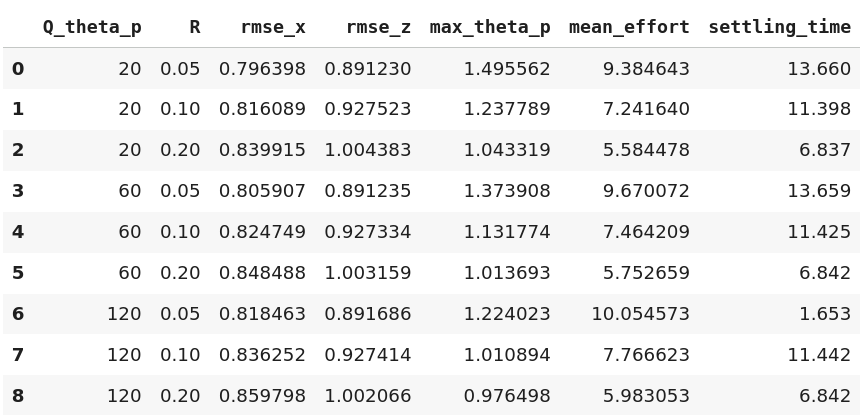

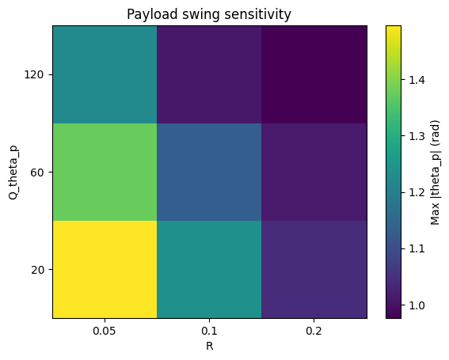

Score is computed by $2{\theta_p}_{max} + 1{rmse}_x + 0.5\bar {effort}$
Based on the above metric, the best combination of $Q_{\theta_p}$ and $R$ are 20 and 0.2.

```
Q_theta_p        20.000000
R                 0.200000
rmse_x            0.839915
rmse_z            1.004383
max_theta_p       1.043319
mean_effort       5.584478
settling_time     6.837000
score             5.718792
```

## Observer Evaluation
To validate the necessity of the Extended Kalman Filter, we compared it against a "Naive" observer (which assumes unmeasured states like velocity are simply 0).

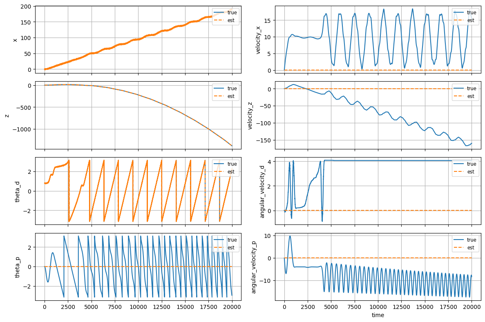
*graphs comparing true values and estimation values of each variable of naive observer*


*graphs comparing true values and estimation values of each variable of EKF observer*

```
State                |   EKF RMSE |  No EKF RMSE
------------------------------------------------
x                    |      0.123 |        0.800
velocity_x           |      0.209 |       10.771
z                    |      0.039 |        0.099
velocity_z           |      0.046 |       87.542
theta_d              |      0.016 |        0.284
angular_velocity_d   |      0.016 |        3.732
theta_p              |      0.100 |        1.789
angular_velocity_p   |      0.776 |        9.976
```

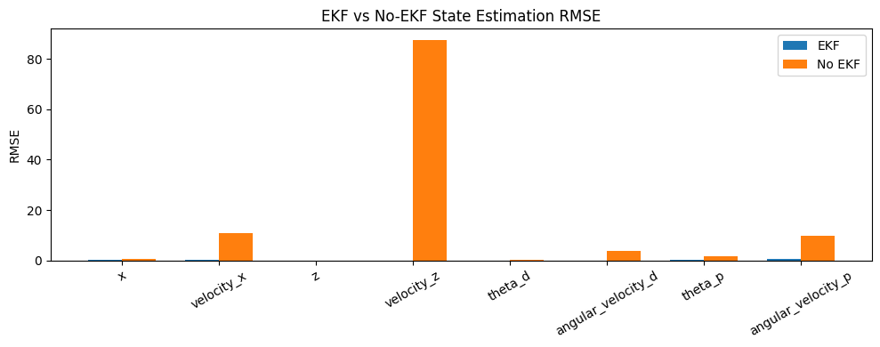
*graphs comparing system without ekf and system with ekf of each variable of EKF observer*

### Conclusion
The Naive approach is functionally useless for dynamic control, with velocity errors huge enough to crash the system immediately. The EKF successfully infers the hidden states (like payload swing velocity) with high accuracy, enabling stable flight.
